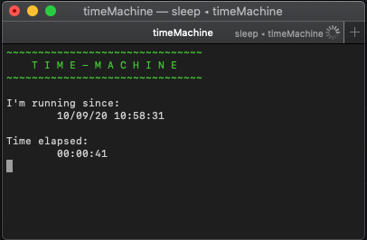

## Time Machine

Time machine is a bash script that tells you the time elapsed since you've started it

## Installing

1. Run the command inside project's folder: 
```chmod +x ./timeMachine.sh```
2. Export protject's path to your $PATH var:
```echo export PATH=`pwd`:\$PATH >> ~/.profile```

## Using

- Run `timeMachine` on your terminal and enjoy :)
- Exit pressing `ˆC`

